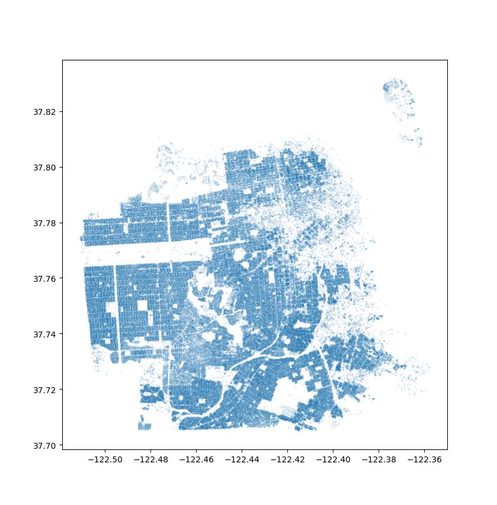
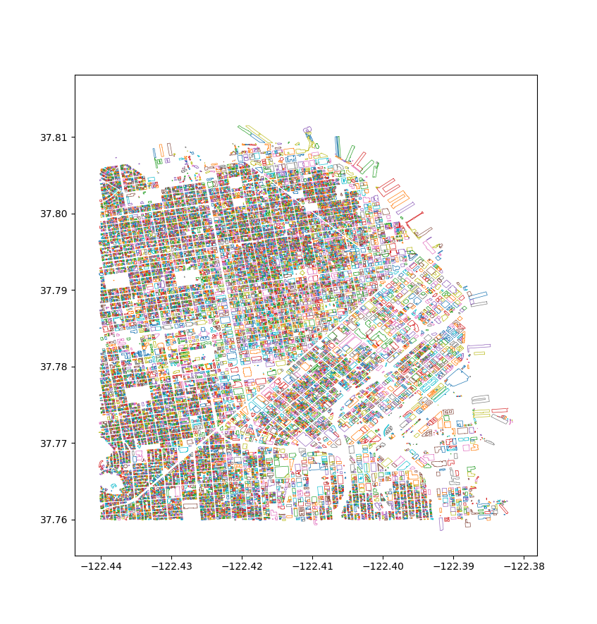
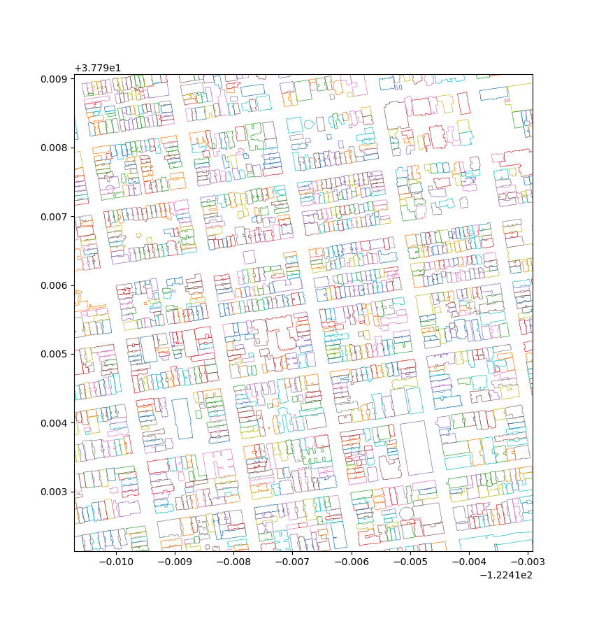
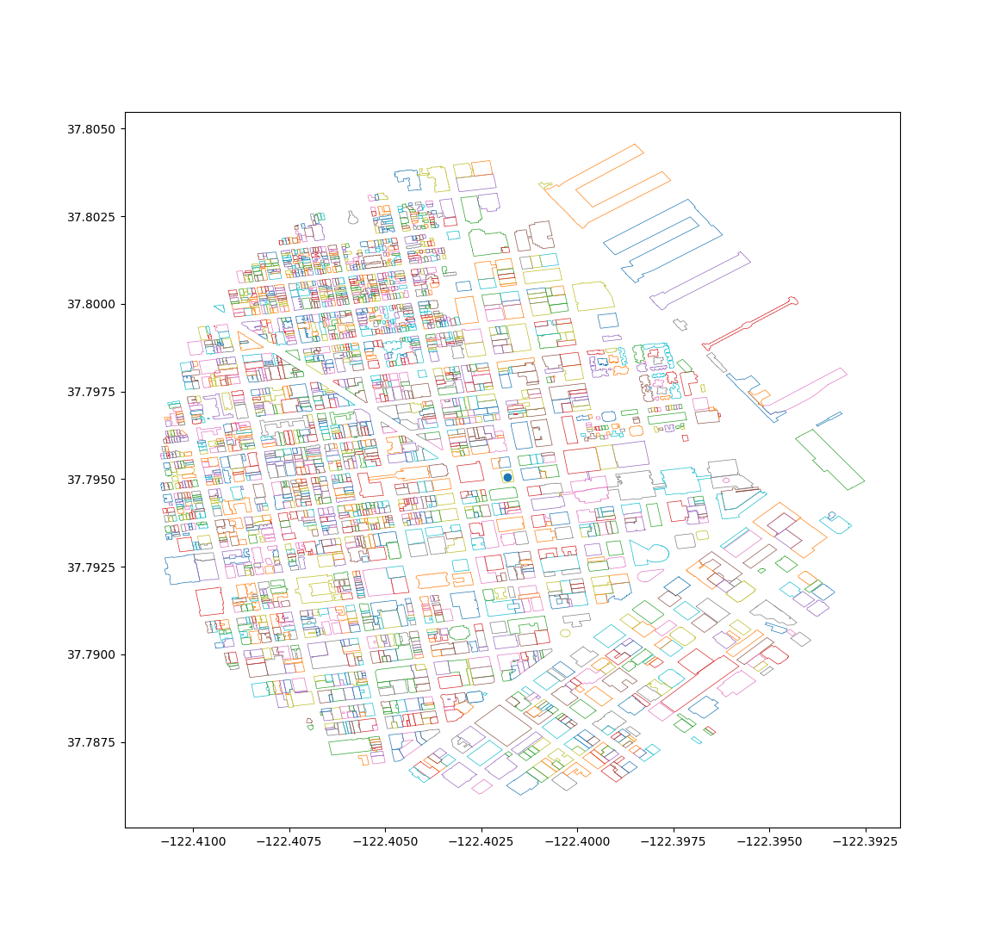
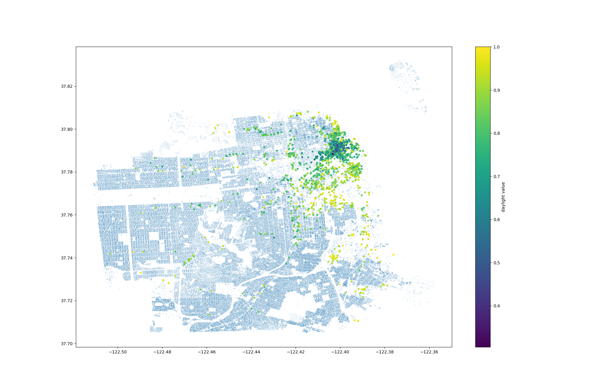

# daylight_simulator

## Overall plot of the locations of buildings in the buildings dataset ##

## Example plot of the shapes of the buildings ##

## Zoomed-in view of the building footprints ##

## Plot of the neighbouring buildings for one of the offices in the office dataset ##

## Plot of the daylight values of all the offices in our dataset ##

